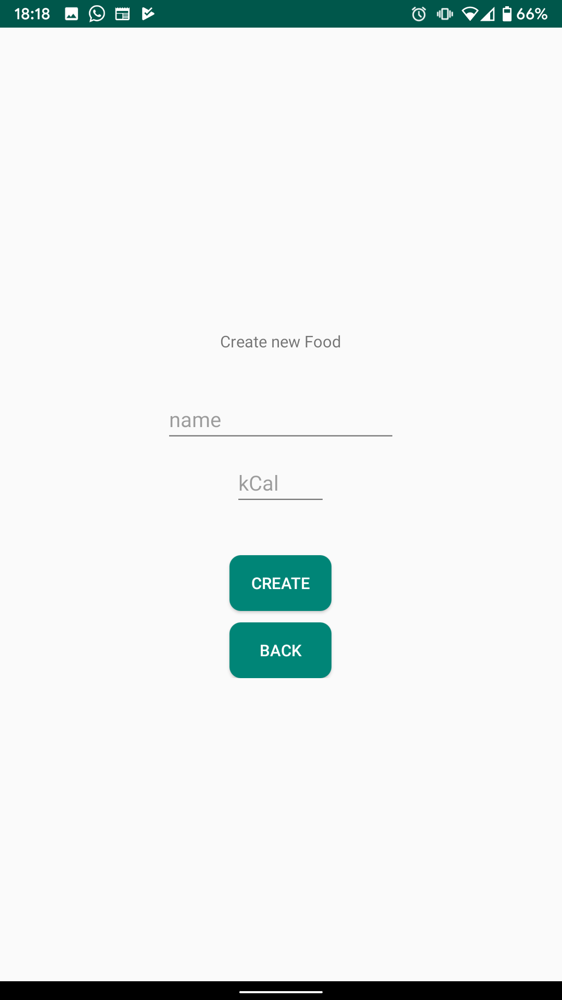
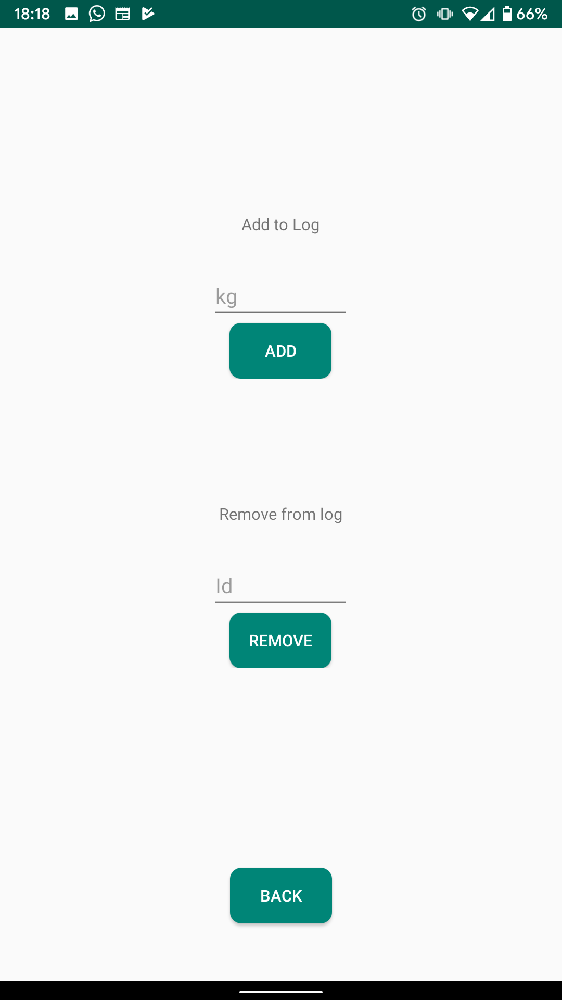

# Weight-Loss-Tracker-for-Android

This application allows the user to track:
  - Food intake
  - Workout routines
  - Weight loss
  
There is also the option to track the user steps.

| Image | Description |
| --- | --- |
|  | This is the view for food intake. It displays all the food in a list within a recyclerView. There is options to remove food from the list. The total calories is displayed at the top to let the User know how much they are consuming that day. |
|  | Working just like the Food Intake section, the workout section also uses a recylerView. |
|  | The user can also view how much weight that they've lost |
| | |
|  | |
|  | |
|  | |
|  | |
|  | |
|  | |

