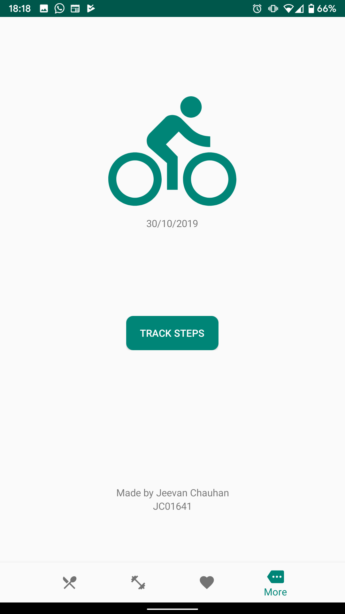

> [!INFO]
> University Project 2018/2019. The goal was to create an appliation for android, the language used was Java

# Weight-Loss-Tracker-for-Android
University Project 2018

This application allows the user to track:
  - Food intake
  - Workout routines
  - Weight loss
  
There is also the option to track the user steps.

| Image | Description |
| --- | --- |
|  | This is the view for food intake. It displays all the food in a list within a recyclerView. There is options to remove food from the list. The total calories is displayed at the top to let the User know how much they are consuming that day. |
|  | The user can view the amount of weight that they've lost easily within this fragment as it calculates the first log of weight and compares it the lastest log and displays the difference. The view also shows the user starting log and latest log while also giving the ability to go to the activity in charge of adding a log or view the logs |
|  | This section is soley to tell the user who created the application and give them the option to take them to the activity that tracks their steps |
| | This section is within another activity, to make it such that every time the user returns to this section of the app it will reset. This is calculated by subtracting the total steps taken by the total steps taken + the steps taken afterwards (this is because the sensor returns every step the user has taken since last reset of the device |
|  | The user can create new food the user intakes, this can be the raw ingredient of a dish it depends on how the user wants view the intake section as. This gives control to the user|
|  | The user can select from a list of previously created workouts to put on the workout veiw that they intend to do for the day. This also uses a recyclerView |
|  | The user is also able to create workouts that they can put within their routine. This allows for the user to only create the same set and rep once and reuse for the sake of effiency |
|  | The user can update their weight whenever they want and the fragment connected to this part will update accordingly|
|  | The user can view the history of their weight loss while also being able to veiw the ID in case they entered a false entry that they want to remove|
|  | working just like the food section this displays the workouts the user intends to do for the day, they can remove the workout when they finish or they can leave the workout there, it will reset by the next day. |

